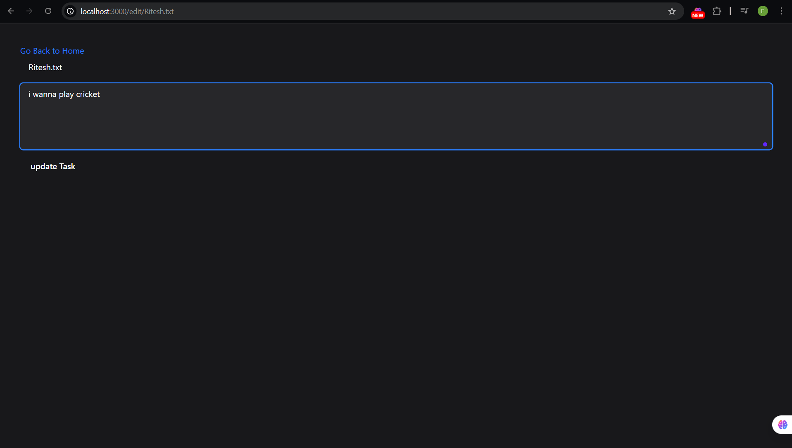

# Notes-App

# Simple File Manager (Node.js + Express + EJS)

A minimal **file-management web app** built with **Node.js**, **Express**, and **EJS templates**.  
Users can:

- Create new text files.
- View the contents of any file.
- Rename (edit) existing files.
- Navigate with a clean Tailwind-styled interface.

---

## 🚀 Features
- **Create**: Add a new `.txt` file by entering a title and details.
- **Read**: View any file’s content in a dedicated page.
- **Rename**: Update a file’s name from the Edit page.
- **Responsive UI**: Tailwind CSS styling with dark theme.

---

## 🛠️ Tech Stack
- **Node.js** – runtime
- **Express** – server framework
- **EJS** – templating engine
- **Tailwind CSS** – styling
- **fs (File System)** – to create, read, and rename files

## 📸 Screenshots

### 1️⃣ Home Page  
Shows a list of all text files with a “Create New File” option.

### 2️⃣ Edit Page  
Allows renaming an existing file.

> *Save these images as* `screenshots/home-page.png` *and* `screenshots/edit-page.png` *inside a* `screenshots/` *folder at the project root, or update the paths if you use different filenames.*

---

## 📂 Project Structure

├── public/ # Static assets (Tailwind output.css, images, etc.)
├── screenshots/ # <-- place your screenshot images here
├── views/ # EJS templates: index.ejs, show.ejs, edit.ejs
├── files/ # Text files created by the app
├── server.js # Main Express server
└── package.json
